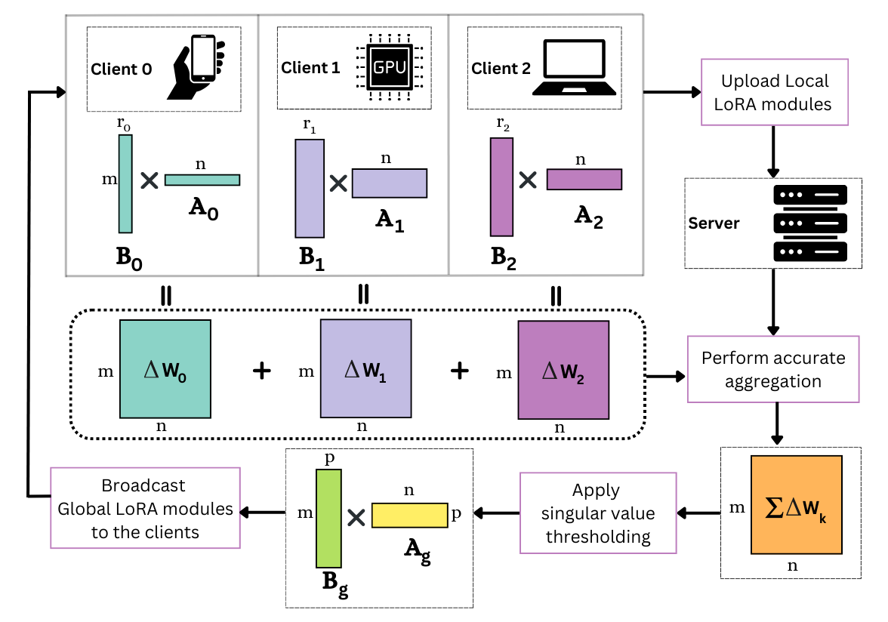

# Optimizing Federated Fine-tuning of LLMs

This repository hosts the implementation of **FLoRIST**, a method designed for **federated fine-tuning** of Large Language Models (LLMs) using **low-rank adaptation (LoRA)** and **Singular Value Thresholding (SVT)**. It offers high accuracy and low communication cost, especially suited for decentralized environments with privacy constraints.

---

## 🔍 Overview

FLoRIST addresses the inefficiencies in federated LLM fine-tuning by:
- Performing **noise-free, weighted aggregation** of LoRA adapters.
- Applying **Singular Value Thresholding (SVT)** to produce compact and accurate global adapters.
- Supporting **both homogeneous and heterogeneous** client settings.

It improves upon previous methods such as **FedIT** and **FLoRA** by achieving:
- Higher accuracy on downstream tasks (like MMLU),
- Better communication efficiency,
- Greater scalability across client capabilities.

<p align="center">
  
</p>

---

## 📁 Dataset

This repo uses the [Databricks Dolly](https://huggingface.co/datasets/databricks/databricks-dolly-15k) dataset. The data has already been downloaded and pre-split into the `./dolly/` folder.

To use your own dataset, format it in the same way as `./data/`.

---

## 📦 Requirements

Install the required dependencies with:

```bash
pip install -r requirements.txt
```

---

## 🚀 Running Experiments

### 🧪 Homogeneous Setting

#### Run FLoRIST:
```bash
python3 main.py --global_model 'meta-llama/Llama-3.2-1B' \
  --data_path "./data" \
  --output_dir './Llama-3.2-1B-dolly-homo-3-1-8/' \
  --num_communication_rounds 3 \
  --local_num_epochs 1 \
  --florist True \
  --num_clients 8 \
  --threshold 0.9
```

#### Run FLoRA:
```bash
python3 main.py --global_model 'meta-llama/Llama-3.2-1B' \
  --data_path "./data" \
  --output_dir './Llama-3.2-1B-dolly-homo-3-1-8/' \
  --num_communication_rounds 3 \
  --local_num_epochs 1 \
  --flora True \
  --num_clients 8
```

#### Run FedIT:
```bash
python3 main.py --global_model 'meta-llama/Llama-3.2-1B' \
  --data_path "./data" \
  --output_dir './Llama-3.2-1B-dolly-homo-3-1-8/' \
  --num_communication_rounds 3 \
  --local_num_epochs 1 \
  --fedit True \
  --num_clients 8
```

---

### 🔀 Heterogeneous Setting

#### Run FLoRIST:
```bash
python3 main.py --global_model 'huggyllama/llama-7b' \
  --data_path "./data" \
  --output_dir './llama-7b-dolly-heter-1-3-8-s/' \
  --num_communication_rounds 1 \
  --local_num_epochs 3 \
  --florist True \
  --num_clients 8 \
  --heter True \
  --zero_padding True \
  --local_micro_batch_size 4 \
  --local_batch_size 64 \
  --threshold 0.9
```

#### Run FLoRA:
```bash
python3 main.py --global_model 'huggyllama/llama-7b' \
  --data_path "./data" \
  --output_dir './llama-7b-dolly-heter-1-3-8-s/' \
  --num_communication_rounds 1 \
  --local_num_epochs 3 \
  --stacking True \
  --num_clients 8 \
  --heter True \
  --local_micro_batch_size 4 \
  --local_batch_size 64
```

#### Run FedIT:
```bash
python3 main.py --global_model 'huggyllama/llama-7b' \
  --data_path "./data" \
  --output_dir './llama-7b-dolly-heter-1-3-8-s/' \
  --num_communication_rounds 1 \
  --local_num_epochs 3 \
  --fedit True \
  --num_clients 8 \
  --heter True \
  --zero_padding True \
  --local_micro_batch_size 4 \
  --local_batch_size 64
```

---

## 📊 Benchmark Results (MMLU Accuracy)

| Model      | Setting  | Method          | Wizard (%) | Dolly (%) | Comm. Efficiency |
|------------|----------|------------------|------------|-----------|------------------|
| TinyLlama  | Homo     | FLoRIST          | **43.63**  | **30.42** | **High**         |
|            |          | FLoRA            | 41.99      | 27.48     | Low              |
|            |          | FedIT            | 41.42      | 28.88     | Medium           |
| TinyLlama  | Hetero   | FLoRIST          | **41.14**  | 29.78     | **High**         |
|            |          | FLoRA            | 38.74      | 26.82     | Low              |
|            |          | FedIT (ZeroPad)  | 30.93      | **31.47** | Medium           |
| LLaMA-7B   | Homo     | FLoRIST          | **29.25**  | **35.58** | **High**         |
|            |          | FLoRA            | 28.50      | 34.38     | Low              |
|            |          | FedIT            | 28.50      | 34.75     | Medium           |
| LLaMA-7B   | Hetero   | FLoRIST          | **28.75**  | **33.94** | **High**         |
|            |          | FLoRA            | 27.04      | 32.77     | Low              |
|            |          | FedIT (ZeroPad)  | 2.58       | 0.27      | Medium           |

> 📌 *All experiments evaluated using the MMLU benchmark (subset of 1,444 questions).*

---

## 🧪 Evaluation

Evaluation is automatically performed at the end of training using the **MMLU benchmark**, assessing logical reasoning and subject knowledge across 57 diverse tasks.

---
## File Organization

    analysis/
    |
    ├── logs/
    │   └── log.md          # log of any progress or relevant information
    |
    ├── figures/            # location of the figures produced for the manuscript
    |
    ├── data/
    |   ├── rawData/        # data obtained from elsewhere
    │   └── derivedData/    # data generated from rawData/ and scripts.*
    |   
    └── supplementaryMaterials/
        ├── supplementaryFigures/     
        |                   # supplementary figures for the main manuscript
        └── supplementaryTables/      
                            # supplementary tables for the main manuscript 
    
    R/Python/etc.           # scripts to run in the following order (also see associated README.md)
        └── script.*        # hypothetical script used to wrangle the raw data, produce figures, analyses, and supplementary materials

        

